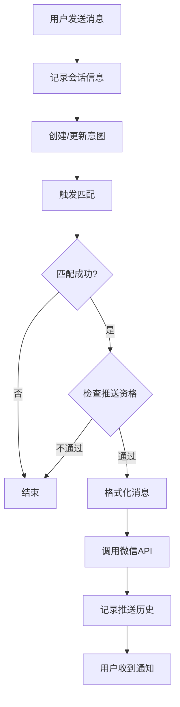

# 微信客服推送通知实施指南

## 📋 概述

本文档详细说明如何将微信客服推送通知功能集成到FriendAI系统中，实现意图匹配结果的自动推送。

## ✨ 功能特性

- **自动推送**：匹配成功后自动发送微信客服消息
- **48小时限制**：遵守微信平台48小时内5条消息限制
- **智能控制**：支持静默时间、推送频率限制
- **模板管理**：可自定义推送消息模板
- **小程序支持**：支持发送小程序卡片消息

## 🏗️ 系统架构

```
用户消息 → 记录会话 → 意图匹配 → 推送检查 → 发送通知
    ↓           ↓           ↓           ↓           ↓
 message    session     intent      push       wechat
 handler    manager     matcher    service     client
```

## 📦 新增文件

1. **push_service_enhanced.py** - 增强版推送服务
2. **add_push_fields.py** - 数据库字段添加脚本
3. **test_push_notification.py** - 推送功能测试脚本
4. **integrate_push_handler.py** - 集成指南脚本

## 🚀 实施步骤

### 步骤1：准备数据库

```bash
# 添加必要的数据库字段
cd WeiXinKeFu
python scripts/add_push_fields.py
```

这将添加：
- `wechat_kf_sessions` 表 - 存储会话信息
- `push_templates` 表 - 推送消息模板
- `user_push_preferences` 新字段 - open_kfid, external_userid等

### 步骤2：更新消息处理器

编辑 `src/handlers/message_handler.py`：

```python
# 1. 添加导入（在文件顶部）
from ..services.push_service_enhanced import enhanced_push_service

# 2. 在handle_wechat_kf_event函数中（收到消息后）
# 约第340行，获取到external_userid和open_kfid后添加：

# 记录用户会话信息（用于推送）
try:
    # 重置48小时计数器
    enhanced_push_service.reset_48h_counter(external_userid)
    
    # 更新会话信息
    enhanced_push_service.update_user_session(
        user_id=external_userid,
        external_userid=external_userid,
        open_kfid=open_kfid
    )
    logger.info(f"更新用户会话: {external_userid}")
except Exception as e:
    logger.warning(f"更新会话失败: {e}")
```

### 步骤3：集成推送触发

编辑 `src/services/intent_matcher.py`：

```python
# 在match_intent_with_profiles函数中
# 匹配成功并保存后（约第500行）添加：

if match_score >= threshold:
    try:
        from ..services.push_service_enhanced import enhanced_push_service
        
        # 准备推送数据
        push_data = {
            'profile_id': profile[0],
            'profile_name': profile[1],
            'intent_id': intent_id,
            'intent_name': intent_name,
            'score': match_score,
            'explanation': explanation,
            'matched_conditions': matched_conditions,
            'match_id': match_id
        }
        
        # 触发推送
        enhanced_push_service.process_match_for_push(push_data, user_id)
        logger.info(f"推送已触发: 意图{intent_id}")
    except Exception as e:
        logger.warning(f"推送失败: {e}")
```

### 步骤4：测试推送功能

```bash
# 运行测试脚本
python test_push_notification.py

# 查看集成指南
python scripts/integrate_push_handler.py
```

### 步骤5：配置推送参数

在数据库中配置用户偏好：

```sql
-- 启用推送
UPDATE user_push_preferences
SET 
    enable_push = 1,
    quiet_hours = '22:00-08:00',  -- 夜间静默
    daily_limit = 10,
    min_score = 0.7
WHERE user_id = 'YOUR_USER_ID';
```

## 📝 推送消息模板

### 默认文本模板

```
🎯 找到匹配的联系人

【张三】符合您的意图【寻找AI合作伙伴】
匹配度：85%
具有AI背景，在北京，有创业经验

回复"查看1"了解详情
```

### 自定义模板

在 `push_templates` 表中添加新模板：

```sql
INSERT INTO push_templates (
    template_name, 
    template_type, 
    content_template
) VALUES (
    'custom_notification',
    'text',
    '新匹配提醒：{profile_name}（{score}%匹配度）'
);
```

## 🔧 配置说明

### 环境变量

确保 `.env` 文件包含：

```bash
# 微信客服配置
WEWORK_CORP_ID=your_corp_id
WEWORK_SECRET=your_secret
WEWORK_TOKEN=your_token
WEWORK_AES_KEY=your_aes_key
```

### 推送限制

| 限制类型 | 数值 | 说明 |
|---------|------|------|
| 48小时窗口 | 48小时 | 用户消息后48小时内可推送 |
| 消息数量 | 5条 | 48小时内最多5条 |
| 静默时间 | 可配置 | 如22:00-08:00 |
| 每日上限 | 可配置 | 默认10条/天 |

## 🧪 测试流程

### 1. 建立会话
用户通过微信发送任意消息给客服账号

### 2. 创建测试意图
```python
# 创建一个测试意图
POST /api/intents
{
    "name": "测试意图",
    "description": "寻找技术合作伙伴",
    "conditions": {
        "keywords": ["技术", "AI"]
    }
}
```

### 3. 触发匹配
系统自动匹配或手动触发：
```python
POST /api/intents/{id}/match
```

### 4. 验证推送
检查微信是否收到推送消息

## 📊 监控与调试

### 查看推送历史

```sql
-- 查看最近推送
SELECT * FROM push_history_USER_ID
ORDER BY created_at DESC
LIMIT 10;

-- 查看会话状态
SELECT * FROM wechat_kf_sessions
WHERE user_id = 'USER_ID';
```

### 日志位置

```bash
# 查看推送日志
tail -f logs/push_service.log

# 查看消息处理日志
tail -f logs/message_handler.log
```

### 常见问题

**Q: 推送失败，提示"无有效会话"**
A: 用户需要在48小时内发送过消息

**Q: 收不到推送消息**
A: 检查：
1. open_kfid是否正确
2. 是否在静默时间内
3. 是否超过推送限制

**Q: 如何获取open_kfid？**
A: 在用户发送消息时，从消息事件的OpenKfId字段获取

## 🔄 推送流程图



## ⚙️ 高级配置

### 小程序消息推送

```python
# 发送小程序卡片
enhanced_push_service.send_wechat_push(
    user_id=user_id,
    message_content="查看匹配详情",
    message_type="miniprogram",
    extra_params={
        'appid': 'wx50fc05960f4152a6',
        'pagepath': 'pages/matches/matches.html',
        'thumb_media_id': 'MEDIA_ID'
    }
)
```

### 批量推送

```python
# 批量处理多个匹配
matches = [match1, match2, match3]
for match in matches[:3]:  # 限制数量
    enhanced_push_service.process_match_for_push(match, user_id)
```

### 定时推送

```python
# 使用APScheduler实现定时推送
from apscheduler.schedulers.background import BackgroundScheduler

scheduler = BackgroundScheduler()
scheduler.add_job(
    func=send_daily_summary,
    trigger="cron",
    hour=9,
    minute=0
)
scheduler.start()
```

## 📈 性能优化

1. **异步处理**：推送不阻塞匹配流程
2. **批量发送**：合并多个推送请求
3. **缓存会话**：减少数据库查询
4. **限流控制**：避免超过API限制

## 🔐 安全考虑

1. **会话验证**：确保用户身份真实
2. **内容过滤**：敏感信息脱敏
3. **频率限制**：防止推送轰炸
4. **日志脱敏**：不记录敏感信息

## 📅 后续优化

- [ ] 支持更多消息类型（图文、菜单等）
- [ ] 推送效果分析（打开率、转化率）
- [ ] A/B测试不同推送模板
- [ ] 智能推送时机优化
- [ ] 推送内容个性化

## 🤝 支持

如有问题，请参考：
- 微信客服官方文档：`weixin_doc/发送消息.md`
- 系统日志：检查推送服务日志
- 测试脚本：运行 `test_push_notification.py`

---

**最后更新**: 2025-01-18
**版本**: v1.0
**作者**: FriendAI Team