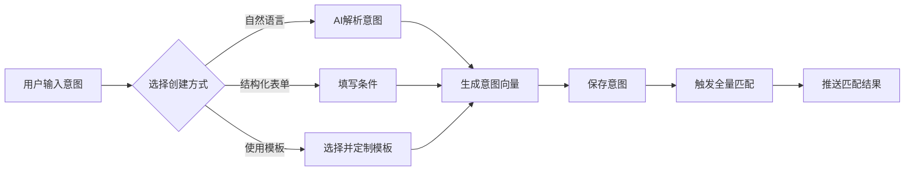

# 意图匹配系统 - 产品设计文档

> 版本：v1.0  
> 日期：2025-01-13  
> 作者：FriendAI Team  
> 状态：设计阶段

## 一、产品概述

### 1.1 产品定位

意图匹配系统是FriendAI的核心创新功能，将传统的被动式联系人管理升级为主动式关系发现平台。通过AI深度理解用户意图，自动发现并推荐有价值的社交关系，实现社交网络的智能化运营。

### 1.2 核心价值

- **商务价值**：自动发现潜在客户、合作伙伴、投资人，提升商业机会转化率
- **社交价值**：精准匹配志同道合的朋友、行业专家，扩展高质量社交圈
- **效率价值**：从海量联系人中快速定位目标人群，节省90%筛选时间
- **智能价值**：持续学习用户偏好，匹配精度随使用时间递增

### 1.3 应用场景

| 场景类型 | 典型意图 | 匹配示例 |
|---------|---------|---------|
| 商务拓展 | "寻找教育行业的采购决策者" | 匹配职位包含"采购总监"且在教育公司的联系人 |
| 招聘需求 | "招聘有AI背景的高级工程师" | 匹配简历包含"机器学习"且职级为高级的技术人才 |
| 投资对接 | "寻找关注SaaS领域的投资人" | 匹配投资偏好包含"企业服务"的投资经理 |
| 资源互换 | "找能提供法律咨询的朋友" | 匹配职业为律师或法务的联系人 |
| 兴趣社交 | "认识喜欢户外运动的同龄人" | 匹配年龄相近且标签包含"运动"的联系人 |

## 二、系统架构

### 2.1 整体架构图

```
┌─────────────────────────────────────────────────────────────┐
│                         前端展示层                           │
│  ┌─────────────┐ ┌─────────────┐ ┌─────────────┐          │
│  │ 意图管理界面 │ │ 匹配结果展示 │ │ 推送通知中心 │          │
│  └─────────────┘ └─────────────┘ └─────────────┘          │
└─────────────────────────────────────────────────────────────┘
                              │
┌─────────────────────────────────────────────────────────────┐
│                          API网关层                           │
│  ┌─────────────────────────────────────────────────┐       │
│  │ RESTful API: /api/intents, /api/matches, etc.  │       │
│  └─────────────────────────────────────────────────┘       │
└─────────────────────────────────────────────────────────────┘
                              │
┌─────────────────────────────────────────────────────────────┐
│                         业务逻辑层                           │
│  ┌──────────┐ ┌──────────┐ ┌──────────┐ ┌──────────┐     │
│  │意图解析器│ │ 匹配引擎 │ │ 评分系统 │ │推送控制器│     │
│  └──────────┘ └──────────┘ └──────────┘ └──────────┘     │
└─────────────────────────────────────────────────────────────┘
                              │
┌─────────────────────────────────────────────────────────────┐
│                           AI层                              │
│  ┌──────────────┐ ┌──────────────┐ ┌──────────────┐       │
│  │ 意图向量化   │ │ 相似度计算   │ │ 解释生成     │       │
│  │ (Embedding)  │ │ (Similarity) │ │ (Explanation)│       │
│  └──────────────┘ └──────────────┘ └──────────────┘       │
└─────────────────────────────────────────────────────────────┘
                              │
┌─────────────────────────────────────────────────────────────┐
│                          数据存储层                          │
│  ┌──────────┐ ┌──────────┐ ┌──────────┐ ┌──────────┐     │
│  │ 意图表   │ │ 匹配记录 │ │ 向量索引 │ │ 反馈数据 │     │
│  └──────────┘ └──────────┘ └──────────┘ └──────────┘     │
└─────────────────────────────────────────────────────────────┘
```

### 2.2 技术栈选型

| 层级 | 技术选型 | 选型理由 |
|------|---------|----------|
| 前端 | 微信小程序原生 + TDesign | 保持技术栈一致性，降低维护成本 |
| API | FastAPI + Bearer认证 | 高性能异步框架，与现有系统集成 |
| AI引擎 | 通义千问API + 向量数据库 | 成本可控，中文语义理解能力强 |
| 数据库 | SQLite/PostgreSQL | 支持JSON字段，便于存储复杂条件 |
| 消息队列 | Redis Queue（可选） | 异步处理大批量匹配任务 |
| 向量索引 | Faiss/Annoy | 高效的向量相似度检索 |

## 三、核心功能设计

### 3.1 意图管理

#### 3.1.1 意图创建流程



#### 3.1.2 意图数据结构

```typescript
interface UserIntent {
  id: string;
  userId: string;
  name: string;                    // 意图名称
  description: string;              // 自然语言描述
  type: 'business' | 'social' | 'recruitment' | 'resource';
  
  // 匹配条件
  conditions: {
    required: Condition[];         // 必要条件（AND逻辑）
    preferred: Condition[];        // 优选条件（加分项）
    keywords: string[];            // 关键词列表
    exclude: Condition[];          // 排除条件
  };
  
  // 匹配配置
  config: {
    threshold: number;             // 匹配阈值 (0-1)
    priority: number;              // 优先级 (1-10)
    maxPushPerDay: number;         // 每日最大推送数
    activeTimeRange?: TimeRange;   // 活跃时间段
    expireAt?: Date;              // 过期时间
  };
  
  // 向量表示
  embedding: Float32Array;         // 768维向量
  
  // 元数据
  status: 'active' | 'paused' | 'expired';
  createdAt: Date;
  updatedAt: Date;
  matchCount: number;              // 累计匹配数
  successCount: number;            // 成功匹配数
}

interface Condition {
  field: string;                   // 字段名
  operator: 'eq' | 'contains' | 'gt' | 'lt' | 'in' | 'between';
  value: any;                      // 匹配值
  weight?: number;                 // 权重
}
```

### 3.2 匹配引擎

#### 3.2.1 双向触发机制

```python
class IntentMatchingEngine:
    """意图匹配引擎 - 核心算法实现"""
    
    def __init__(self):
        self.embedder = QwenEmbedder()           # 向量化模型
        self.vector_db = VectorDatabase()        # 向量数据库
        self.scorer = MatchScorer()              # 评分系统
        self.explainer = MatchExplainer()        # 解释生成器
    
    async def on_profile_change(self, profile_id: str, user_id: str):
        """
        联系人信息变更时触发匹配
        触发场景：
        1. 新增联系人
        2. 编辑联系人信息
        3. AI分析更新画像
        """
        # 获取更新后的联系人信息
        profile = await self.db.get_profile(profile_id)
        
        # 生成或更新联系人向量
        profile_vector = await self.embedder.embed_profile(profile)
        await self.vector_db.upsert(f"profile_{profile_id}", profile_vector)
        
        # 获取用户所有活跃意图
        active_intents = await self.db.get_active_intents(user_id)
        
        # 批量匹配
        matches = []
        for intent in active_intents:
            # 计算综合匹配分数
            score = await self.calculate_match_score(
                intent=intent,
                profile=profile,
                intent_vector=intent.embedding,
                profile_vector=profile_vector
            )
            
            if score >= intent.config.threshold:
                # 生成匹配解释
                explanation = await self.explainer.explain(intent, profile, score)
                
                matches.append({
                    'intent_id': intent.id,
                    'profile_id': profile_id,
                    'score': score,
                    'explanation': explanation,
                    'matched_conditions': self.get_matched_conditions(intent, profile)
                })
        
        # 保存匹配记录并推送
        await self.process_matches(matches, user_id)
    
    async def on_intent_change(self, intent_id: str, user_id: str):
        """
        意图变更时触发匹配
        触发场景：
        1. 创建新意图
        2. 修改意图条件
        3. 重新激活意图
        """
        # 获取意图详情
        intent = await self.db.get_intent(intent_id)
        
        # 生成或更新意图向量
        intent_vector = await self.embedder.embed_intent(intent)
        await self.vector_db.upsert(f"intent_{intent_id}", intent_vector)
        
        # 向量检索：找出相似的联系人
        similar_profiles = await self.vector_db.search(
            query_vector=intent_vector,
            top_k=100,
            filter={'user_id': user_id}
        )
        
        # 精细化匹配和排序
        matches = []
        for profile_id, vector_similarity in similar_profiles:
            profile = await self.db.get_profile(profile_id)
            
            # 综合评分
            score = await self.calculate_match_score(
                intent=intent,
                profile=profile,
                intent_vector=intent_vector,
                profile_vector=await self.vector_db.get(f"profile_{profile_id}"),
                vector_similarity=vector_similarity
            )
            
            if score >= intent.config.threshold:
                explanation = await self.explainer.explain(intent, profile, score)
                matches.append({
                    'intent_id': intent_id,
                    'profile_id': profile_id,
                    'score': score,
                    'explanation': explanation
                })
        
        # 排序并取Top N
        matches.sort(key=lambda x: x['score'], reverse=True)
        top_matches = matches[:intent.config.maxPushPerDay]
        
        # 保存并推送
        await self.process_matches(top_matches, user_id)
    
    async def calculate_match_score(self, intent, profile, 
                                   intent_vector, profile_vector,
                                   vector_similarity=None):
        """
        综合评分算法
        
        评分维度：
        1. 向量相似度 (40%)：语义理解层面的匹配
        2. 必要条件 (30%)：硬性要求的满足程度
        3. 优选条件 (20%)：加分项的满足程度
        4. 关键词匹配 (10%)：文本层面的直接匹配
        """
        scores = {}
        
        # 1. 向量相似度
        if vector_similarity is None:
            vector_similarity = cosine_similarity(intent_vector, profile_vector)
        scores['vector'] = vector_similarity
        
        # 2. 必要条件匹配
        required_score = self.evaluate_conditions(
            conditions=intent.conditions.required,
            profile=profile,
            strict=True  # 必要条件必须全部满足
        )
        scores['required'] = required_score
        
        # 3. 优选条件匹配
        preferred_score = self.evaluate_conditions(
            conditions=intent.conditions.preferred,
            profile=profile,
            strict=False  # 优选条件部分满足即可
        )
        scores['preferred'] = preferred_score
        
        # 4. 关键词匹配
        keyword_score = self.evaluate_keywords(
            keywords=intent.conditions.keywords,
            profile=profile
        )
        scores['keyword'] = keyword_score
        
        # 5. 排除条件检查
        if self.has_exclude_conditions(intent.conditions.exclude, profile):
            return 0  # 触发排除条件，直接返回0分
        
        # 加权计算最终分数
        final_score = (
            scores['vector'] * 0.4 +
            scores['required'] * 0.3 +
            scores['preferred'] * 0.2 +
            scores['keyword'] * 0.1
        )
        
        # 根据意图优先级调整分数
        priority_boost = intent.config.priority / 100
        final_score = min(1.0, final_score * (1 + priority_boost))
        
        return final_score
```

#### 3.2.2 匹配算法详解

```python
class MatchScorer:
    """匹配评分系统"""
    
    def evaluate_conditions(self, conditions: List[Condition], 
                           profile: dict, strict: bool) -> float:
        """评估条件匹配度"""
        if not conditions:
            return 1.0
        
        matched = 0
        total_weight = 0
        
        for condition in conditions:
            weight = condition.get('weight', 1.0)
            total_weight += weight
            
            if self.check_condition(condition, profile):
                matched += weight
            elif strict:
                return 0  # 严格模式下，一个条件不满足就返回0
        
        return matched / total_weight if total_weight > 0 else 0
    
    def check_condition(self, condition: Condition, profile: dict) -> bool:
        """检查单个条件"""
        field_value = self.get_field_value(profile, condition['field'])
        
        if field_value is None:
            return False
        
        operator = condition['operator']
        expected = condition['value']
        
        if operator == 'eq':
            return field_value == expected
        elif operator == 'contains':
            return expected in str(field_value)
        elif operator == 'gt':
            return float(field_value) > float(expected)
        elif operator == 'lt':
            return float(field_value) < float(expected)
        elif operator == 'in':
            return field_value in expected
        elif operator == 'between':
            return expected[0] <= float(field_value) <= expected[1]
        
        return False
    
    def evaluate_keywords(self, keywords: List[str], profile: dict) -> float:
        """评估关键词匹配度"""
        if not keywords:
            return 1.0
        
        # 构建联系人的文本表示
        profile_text = self.build_profile_text(profile)
        profile_text_lower = profile_text.lower()
        
        matched_count = 0
        for keyword in keywords:
            if keyword.lower() in profile_text_lower:
                matched_count += 1
        
        return matched_count / len(keywords)
    
    def build_profile_text(self, profile: dict) -> str:
        """构建联系人的文本表示用于关键词匹配"""
        text_parts = []
        
        # 重要字段
        important_fields = [
            'name', 'company', 'position', 'education',
            'location', 'personality', 'ai_summary'
        ]
        
        for field in important_fields:
            if field in profile and profile[field]:
                text_parts.append(str(profile[field]))
        
        # 标签
        if 'tags' in profile and profile['tags']:
            text_parts.extend(profile['tags'])
        
        return ' '.join(text_parts)
```

### 3.3 AI能力集成

#### 3.3.1 向量化模型

```python
class QwenEmbedder:
    """基于通义千问的向量化模型"""
    
    def __init__(self):
        self.api_key = config.qwen_api_key
        self.model = "text-embedding-v2"  # 通义千问向量模型
        self.dimension = 768
    
    async def embed_intent(self, intent: UserIntent) -> np.ndarray:
        """意图向量化"""
        # 构建意图的文本表示
        intent_text = self.build_intent_text(intent)
        
        # 调用向量化API
        response = await self.call_embedding_api(intent_text)
        
        # 缓存向量
        await self.cache_embedding(f"intent_{intent.id}", response.embedding)
        
        return np.array(response.embedding)
    
    async def embed_profile(self, profile: dict) -> np.ndarray:
        """联系人画像向量化"""
        # 构建画像的文本表示
        profile_text = self.build_profile_text(profile)
        
        # 调用向量化API
        response = await self.call_embedding_api(profile_text)
        
        # 缓存向量
        await self.cache_embedding(f"profile_{profile['id']}", response.embedding)
        
        return np.array(response.embedding)
    
    def build_intent_text(self, intent: UserIntent) -> str:
        """构建意图的文本表示"""
        parts = [
            f"意图名称：{intent.name}",
            f"描述：{intent.description}",
            f"类型：{intent.type}",
        ]
        
        # 添加必要条件
        if intent.conditions.required:
            required_text = "必须满足：" + ", ".join([
                f"{c['field']}={c['value']}" 
                for c in intent.conditions.required
            ])
            parts.append(required_text)
        
        # 添加关键词
        if intent.conditions.keywords:
            parts.append(f"关键词：{', '.join(intent.conditions.keywords)}")
        
        return "\n".join(parts)
    
    def build_profile_text(self, profile: dict) -> str:
        """构建联系人的完整文本表示"""
        parts = []
        
        # 基础信息
        if profile.get('name'):
            parts.append(f"姓名：{profile['name']}")
        if profile.get('company'):
            parts.append(f"公司：{profile['company']}")
        if profile.get('position'):
            parts.append(f"职位：{profile['position']}")
        if profile.get('location'):
            parts.append(f"地点：{profile['location']}")
        
        # 个人特征
        if profile.get('age'):
            parts.append(f"年龄：{profile['age']}")
        if profile.get('education'):
            parts.append(f"学历：{profile['education']}")
        if profile.get('personality'):
            parts.append(f"性格：{profile['personality']}")
        
        # AI分析
        if profile.get('ai_summary'):
            parts.append(f"简介：{profile['ai_summary']}")
        
        # 标签
        if profile.get('tags'):
            parts.append(f"标签：{', '.join(profile['tags'])}")
        
        return "\n".join(parts)
```

#### 3.3.2 匹配解释生成

```python
class MatchExplainer:
    """匹配解释生成器"""
    
    def __init__(self):
        self.qwen_client = QwenClient()
    
    async def explain(self, intent: UserIntent, profile: dict, 
                     score: float) -> str:
        """生成人类可读的匹配解释"""
        
        # 快速解释（基于规则）
        if score > 0.9:
            return await self.generate_high_match_explanation(intent, profile)
        
        # AI解释（基于大模型）
        prompt = f"""
请用一句话解释为什么这个联系人符合用户的意图：

用户意图：{intent.description}

联系人信息：
- 姓名：{profile.get('name', '未知')}
- 公司：{profile.get('company', '未知')}
- 职位：{profile.get('position', '未知')}
- 特征：{profile.get('ai_summary', '无')}

匹配分数：{score:.2f}

要求：
1. 突出最关键的匹配点
2. 不超过30个字
3. 使用用户容易理解的语言
"""
        
        response = await self.qwen_client.generate(prompt)
        return response.strip()
    
    async def generate_high_match_explanation(self, intent, profile):
        """高匹配度的快速解释"""
        matched_conditions = self.get_matched_conditions(intent, profile)
        
        if len(matched_conditions) >= 3:
            return f"完美匹配：{', '.join(matched_conditions[:3])}"
        elif len(matched_conditions) >= 1:
            return f"高度匹配：{matched_conditions[0]}"
        else:
            return "综合评分较高，建议查看详情"
    
    def get_matched_conditions(self, intent, profile):
        """获取匹配的条件列表"""
        matched = []
        
        for condition in intent.conditions.required:
            if self.check_condition(condition, profile):
                matched.append(f"{condition['field']}符合要求")
        
        for keyword in intent.conditions.keywords:
            profile_text = str(profile).lower()
            if keyword.lower() in profile_text:
                matched.append(f"包含关键词'{keyword}'")
        
        return matched
```

### 3.4 推送策略

#### 3.4.1 智能推送控制

```python
class NotificationController:
    """推送控制器 - 避免打扰用户"""
    
    def __init__(self):
        self.config = {
            'daily_limit': 10,           # 每日推送上限
            'hourly_limit': 3,           # 每小时推送上限
            'min_interval': 1800,        # 最小推送间隔（秒）
            'quiet_hours': [(22, 8)],    # 免打扰时段
            'batch_threshold': 3,        # 批量推送阈值
            'dedup_window': 86400        # 去重时间窗口（秒）
        }
    
    async def should_push(self, user_id: str, match: dict) -> bool:
        """判断是否应该推送"""
        
        # 1. 检查免打扰时段
        if self.is_quiet_hours():
            return False
        
        # 2. 检查推送频率限制
        if not await self.check_rate_limit(user_id):
            return False
        
        # 3. 检查重复推送
        if await self.is_duplicate(user_id, match):
            return False
        
        # 4. 检查用户偏好设置
        user_pref = await self.get_user_preference(user_id)
        if not user_pref.enable_push:
            return False
        
        # 5. 智能批量决策
        if await self.should_batch(user_id, match):
            await self.add_to_batch(user_id, match)
            return False  # 加入批量队列，暂不推送
        
        return True
    
    async def push_notification(self, user_id: str, matches: List[dict]):
        """发送推送通知"""
        
        # 根据匹配数量选择推送模板
        if len(matches) == 1:
            await self.push_single_match(user_id, matches[0])
        else:
            await self.push_batch_matches(user_id, matches)
        
        # 记录推送历史
        await self.record_push_history(user_id, matches)
    
    async def push_single_match(self, user_id: str, match: dict):
        """单个匹配推送"""
        intent = await self.db.get_intent(match['intent_id'])
        profile = await self.db.get_profile(match['profile_id'])
        
        # 构建推送消息
        message = {
            'title': f"发现符合「{intent.name}」的联系人",
            'content': f"{profile['name']} - {profile.get('company', '')} {profile.get('position', '')}",
            'detail': match['explanation'],
            'score': f"匹配度：{match['score']*100:.0f}%",
            'action': {
                'type': 'navigate',
                'page': '/pages/contact-detail/contact-detail',
                'params': {'id': profile['id']}
            }
        }
        
        # 发送推送
        await self.send_wechat_message(user_id, message)
    
    async def push_batch_matches(self, user_id: str, matches: List[dict]):
        """批量匹配推送"""
        
        # 按意图分组
        grouped = {}
        for match in matches:
            intent_id = match['intent_id']
            if intent_id not in grouped:
                grouped[intent_id] = []
            grouped[intent_id].append(match)
        
        # 构建摘要消息
        summary_parts = []
        for intent_id, intent_matches in grouped.items():
            intent = await self.db.get_intent(intent_id)
            summary_parts.append(
                f"「{intent.name}」匹配{len(intent_matches)}人"
            )
        
        message = {
            'title': f"发现{len(matches)}个新匹配",
            'content': "，".join(summary_parts),
            'action': {
                'type': 'navigate',
                'page': '/pages/matches/matches'
            }
        }
        
        await self.send_wechat_message(user_id, message)
```

## 四、数据库设计

### 4.1 核心数据表

```sql
-- 用户意图表
CREATE TABLE user_intents (
    id INTEGER PRIMARY KEY AUTOINCREMENT,
    user_id TEXT NOT NULL,                    -- 微信用户ID
    name TEXT NOT NULL,                        -- 意图名称
    description TEXT,                          -- 自然语言描述
    type TEXT DEFAULT 'general',              -- 意图类型
    
    -- 条件存储（JSON格式）
    conditions JSON NOT NULL DEFAULT '{}',     -- 匹配条件
    
    -- 向量数据
    embedding BLOB,                           -- 768维向量
    embedding_model TEXT DEFAULT 'qwen-v2',   -- 向量模型版本
    
    -- 配置项
    threshold REAL DEFAULT 0.7,               -- 匹配阈值
    priority INTEGER DEFAULT 5,               -- 优先级(1-10)
    max_push_per_day INTEGER DEFAULT 5,       -- 每日推送上限
    
    -- 状态控制
    status TEXT DEFAULT 'active',             -- active/paused/expired
    expire_at TIMESTAMP,                      -- 过期时间
    
    -- 统计数据
    match_count INTEGER DEFAULT 0,            -- 累计匹配数
    success_count INTEGER DEFAULT 0,          -- 成功匹配数
    last_match_at TIMESTAMP,                  -- 最后匹配时间
    
    -- 时间戳
    created_at TIMESTAMP DEFAULT CURRENT_TIMESTAMP,
    updated_at TIMESTAMP DEFAULT CURRENT_TIMESTAMP,
    
    INDEX idx_user_status (user_id, status),
    INDEX idx_expire (expire_at)
);

-- 匹配记录表
CREATE TABLE intent_matches (
    id INTEGER PRIMARY KEY AUTOINCREMENT,
    intent_id INTEGER NOT NULL,
    profile_id INTEGER NOT NULL,
    user_id TEXT NOT NULL,                    -- 冗余字段，方便查询
    
    -- 匹配详情
    match_score REAL NOT NULL,                -- 匹配分数(0-1)
    score_details JSON,                       -- 各维度分数明细
    matched_conditions JSON,                  -- 匹配的条件列表
    explanation TEXT,                         -- 匹配解释
    
    -- 推送状态
    is_pushed BOOLEAN DEFAULT FALSE,          -- 是否已推送
    pushed_at TIMESTAMP,                      -- 推送时间
    push_channel TEXT,                        -- 推送渠道
    
    -- 用户反馈
    user_feedback TEXT,                       -- positive/negative/ignored
    feedback_at TIMESTAMP,                    -- 反馈时间
    feedback_note TEXT,                       -- 反馈备注
    
    -- 状态
    status TEXT DEFAULT 'pending',            -- pending/pushed/archived
    created_at TIMESTAMP DEFAULT CURRENT_TIMESTAMP,
    
    FOREIGN KEY (intent_id) REFERENCES user_intents(id) ON DELETE CASCADE,
    INDEX idx_user_matches (user_id, status),
    INDEX idx_intent_matches (intent_id, match_score DESC),
    INDEX idx_profile_matches (profile_id),
    UNIQUE idx_unique_match (intent_id, profile_id)
);

-- 向量索引表（优化检索性能）
CREATE TABLE vector_index (
    id TEXT PRIMARY KEY,                      -- 格式：type_id (如 intent_123)
    vector_type TEXT NOT NULL,                -- intent/profile
    entity_id INTEGER NOT NULL,               -- 关联的实体ID
    user_id TEXT NOT NULL,                    -- 所属用户
    embedding BLOB NOT NULL,                  -- 向量数据
    metadata JSON,                            -- 元数据
    created_at TIMESTAMP DEFAULT CURRENT_TIMESTAMP,
    updated_at TIMESTAMP DEFAULT CURRENT_TIMESTAMP,
    
    INDEX idx_vector_type (vector_type, user_id),
    INDEX idx_entity (entity_id)
);

-- 推送历史表
CREATE TABLE push_history (
    id INTEGER PRIMARY KEY AUTOINCREMENT,
    user_id TEXT NOT NULL,
    match_ids JSON NOT NULL,                  -- 推送的匹配ID列表
    push_type TEXT NOT NULL,                  -- single/batch/digest
    message JSON NOT NULL,                    -- 推送消息内容
    status TEXT DEFAULT 'sent',               -- sent/failed/read
    sent_at TIMESTAMP DEFAULT CURRENT_TIMESTAMP,
    read_at TIMESTAMP,
    
    INDEX idx_user_history (user_id, sent_at DESC)
);

-- 用户推送偏好表
CREATE TABLE user_push_preferences (
    user_id TEXT PRIMARY KEY,
    enable_push BOOLEAN DEFAULT TRUE,         -- 是否启用推送
    daily_limit INTEGER DEFAULT 10,           -- 每日推送上限
    quiet_hours JSON,                         -- 免打扰时段
    batch_mode TEXT DEFAULT 'smart',          -- immediate/batch/smart
    min_score REAL DEFAULT 0.7,              -- 最低推送分数
    preferred_time JSON,                      -- 偏好推送时间
    created_at TIMESTAMP DEFAULT CURRENT_TIMESTAMP,
    updated_at TIMESTAMP DEFAULT CURRENT_TIMESTAMP
);
```

### 4.2 示例数据

```json
// 意图示例：寻找技术合伙人
{
  "id": "intent_001",
  "user_id": "wx_user_123",
  "name": "寻找技术合伙人",
  "description": "寻找有AI背景、创业经验的技术合伙人，最好在北京或上海",
  "type": "recruitment",
  "conditions": {
    "required": [
      {"field": "position", "operator": "contains", "value": "CTO"},
      {"field": "location", "operator": "in", "value": ["北京", "上海"]}
    ],
    "preferred": [
      {"field": "company", "operator": "contains", "value": "AI"},
      {"field": "education", "operator": "contains", "value": "985"}
    ],
    "keywords": ["人工智能", "机器学习", "创业", "技术管理"],
    "exclude": [
      {"field": "company", "operator": "contains", "value": "竞争对手公司"}
    ]
  },
  "threshold": 0.75,
  "priority": 9,
  "status": "active"
}

// 匹配记录示例
{
  "id": "match_001",
  "intent_id": "intent_001",
  "profile_id": "profile_456",
  "user_id": "wx_user_123",
  "match_score": 0.82,
  "score_details": {
    "vector": 0.85,
    "required": 1.0,
    "preferred": 0.5,
    "keyword": 0.6
  },
  "matched_conditions": [
    "职位包含CTO",
    "位于北京",
    "提到人工智能"
  ],
  "explanation": "张三是AI创业公司的CTO，有10年技术管理经验，正好在北京",
  "is_pushed": true,
  "pushed_at": "2025-01-13 10:30:00",
  "user_feedback": "positive"
}
```

## 五、API接口设计

### 5.1 意图管理接口

```typescript
// 创建意图
POST /api/intents
Request:
{
  "name": "寻找投资人",
  "description": "寻找关注企业服务领域的天使投资人",
  "type": "business",
  "conditions": {
    "keywords": ["投资", "天使", "企业服务", "SaaS"]
  },
  "config": {
    "threshold": 0.7,
    "priority": 8,
    "maxPushPerDay": 3
  }
}
Response:
{
  "success": true,
  "data": {
    "intentId": "intent_123",
    "message": "意图创建成功，正在进行全量匹配",
    "estimatedMatches": 15
  }
}

// 获取意图列表
GET /api/intents?status=active&page=1&size=10
Response:
{
  "success": true,
  "data": {
    "intents": [...],
    "total": 5,
    "page": 1
  }
}

// 更新意图
PUT /api/intents/{intentId}
Request: { ...updated fields... }

// 删除意图
DELETE /api/intents/{intentId}

// 暂停/恢复意图
POST /api/intents/{intentId}/toggle
Request: { "status": "paused" }

// 手动触发匹配
POST /api/intents/{intentId}/match
Response:
{
  "success": true,
  "data": {
    "matchCount": 8,
    "topMatches": [...]
  }
}
```

### 5.2 匹配结果接口

```typescript
// 获取匹配结果
GET /api/matches?intentId=xxx&status=pending&minScore=0.8
Response:
{
  "success": true,
  "data": {
    "matches": [
      {
        "matchId": "match_001",
        "intent": { "name": "寻找投资人", ... },
        "profile": { "name": "张三", "company": "XX资本", ... },
        "score": 0.85,
        "explanation": "张三是XX资本的投资经理，关注企业服务领域",
        "matchedConditions": ["包含'投资'", "提到'SaaS'"],
        "createdAt": "2025-01-13 10:00:00"
      }
    ],
    "total": 15
  }
}

// 获取单个匹配详情
GET /api/matches/{matchId}

// 用户反馈
PUT /api/matches/{matchId}/feedback
Request:
{
  "feedback": "positive",  // positive/negative/ignored
  "note": "确实是我要找的人"
}

// 批量操作
POST /api/matches/batch
Request:
{
  "matchIds": ["match_001", "match_002"],
  "action": "archive"  // archive/push/delete
}
```

### 5.3 推送管理接口

```typescript
// 获取推送历史
GET /api/push/history?page=1&size=20

// 更新推送偏好
PUT /api/push/preferences
Request:
{
  "enablePush": true,
  "dailyLimit": 10,
  "quietHours": [{"start": "22:00", "end": "08:00"}],
  "batchMode": "smart",
  "minScore": 0.75
}

// 标记已读
POST /api/push/{pushId}/read
```

## 六、前端界面设计

### 6.1 意图管理页面

```html
<!-- pages/intent-manager/intent-manager.wxml -->
<view class="intent-page">
  <!-- 顶部操作栏 -->
  <view class="top-bar">
    <text class="page-title">我的意图</text>
    <button class="create-btn" bindtap="showCreateDialog">
      <text class="btn-icon">+</text>
      <text class="btn-text">创建意图</text>
    </button>
  </view>
  
  <!-- 意图统计 -->
  <view class="stats-card">
    <view class="stat-item">
      <text class="stat-value">{{stats.activeCount}}</text>
      <text class="stat-label">活跃意图</text>
    </view>
    <view class="stat-item">
      <text class="stat-value">{{stats.totalMatches}}</text>
      <text class="stat-label">累计匹配</text>
    </view>
    <view class="stat-item">
      <text class="stat-value">{{stats.todayPush}}</text>
      <text class="stat-label">今日推送</text>
    </view>
  </view>
  
  <!-- 意图列表 -->
  <view class="intent-list">
    <view wx:for="{{intents}}" class="intent-card">
      <view class="intent-header">
        <view class="intent-info">
          <text class="intent-name">{{item.name}}</text>
          <text class="intent-type">{{item.typeLabel}}</text>
        </view>
        <switch checked="{{item.status === 'active'}}" 
                bindchange="toggleIntent" 
                data-id="{{item.id}}"/>
      </view>
      
      <text class="intent-desc">{{item.description}}</text>
      
      <view class="intent-tags">
        <text wx:for="{{item.keywords}}" wx:for-item="keyword" 
              class="keyword-tag">{{keyword}}</text>
      </view>
      
      <view class="intent-footer">
        <text class="match-info">匹配 {{item.matchCount}} 人</text>
        <view class="intent-actions">
          <text class="action-link" bindtap="viewMatches" 
                data-id="{{item.id}}">查看匹配</text>
          <text class="action-link" bindtap="editIntent" 
                data-id="{{item.id}}">编辑</text>
          <text class="action-link danger" bindtap="deleteIntent" 
                data-id="{{item.id}}">删除</text>
        </view>
      </view>
    </view>
  </view>
  
  <!-- 创建意图对话框 -->
  <view class="dialog-overlay" wx:if="{{showCreateDialog}}" 
        bindtap="hideCreateDialog">
    <view class="dialog-content" catchtap="stopPropagation">
      <text class="dialog-title">创建新意图</text>
      
      <!-- 创建方式选择 -->
      <view class="create-mode-tabs">
        <text class="tab {{createMode === 'natural' ? 'active' : ''}}"
              bindtap="switchMode" data-mode="natural">自然语言</text>
        <text class="tab {{createMode === 'template' ? 'active' : ''}}"
              bindtap="switchMode" data-mode="template">使用模板</text>
        <text class="tab {{createMode === 'advanced' ? 'active' : ''}}"
              bindtap="switchMode" data-mode="advanced">高级模式</text>
      </view>
      
      <!-- 自然语言模式 -->
      <view wx:if="{{createMode === 'natural'}}" class="natural-mode">
        <input class="intent-name-input" placeholder="给意图起个名字" 
               model:value="{{formData.name}}"/>
        <textarea class="intent-desc-input" 
                  placeholder="用一段话描述你想找什么样的人..."
                  model:value="{{formData.description}}"/>
        <view class="ai-tips">
          <text class="tips-icon">💡</text>
          <text class="tips-text">AI会自动理解你的需求并设置匹配条件</text>
        </view>
      </view>
      
      <!-- 模板模式 -->
      <view wx:if="{{createMode === 'template'}}" class="template-mode">
        <scroll-view class="template-list" scroll-y>
          <view wx:for="{{templates}}" class="template-item" 
                bindtap="selectTemplate" data-index="{{index}}">
            <text class="template-name">{{item.name}}</text>
            <text class="template-desc">{{item.description}}</text>
          </view>
        </scroll-view>
      </view>
      
      <!-- 高级模式 -->
      <view wx:if="{{createMode === 'advanced'}}" class="advanced-mode">
        <input placeholder="意图名称" model:value="{{formData.name}}"/>
        
        <view class="condition-section">
          <text class="section-title">必要条件（必须满足）</text>
          <view wx:for="{{formData.requiredConditions}}" 
                class="condition-item">
            <picker bindchange="selectField" data-index="{{index}}">
              <input placeholder="字段" value="{{item.field}}"/>
            </picker>
            <picker bindchange="selectOperator" data-index="{{index}}">
              <input placeholder="条件" value="{{item.operator}}"/>
            </picker>
            <input placeholder="值" model:value="{{item.value}}"/>
            <text class="remove-btn" bindtap="removeCondition" 
                  data-type="required" data-index="{{index}}">×</text>
          </view>
          <button class="add-condition-btn" bindtap="addCondition" 
                  data-type="required">+ 添加条件</button>
        </view>
        
        <view class="condition-section">
          <text class="section-title">关键词</text>
          <input placeholder="输入关键词，用空格分隔" 
                 model:value="{{formData.keywordsText}}"/>
        </view>
      </view>
      
      <!-- 配置项 -->
      <view class="config-section">
        <view class="config-item">
          <text class="config-label">匹配阈值</text>
          <slider min="50" max="95" value="{{formData.threshold}}" 
                  bindchange="onThresholdChange"/>
          <text class="config-value">{{formData.threshold}}%</text>
        </view>
        
        <view class="config-item">
          <text class="config-label">优先级</text>
          <picker range="{{priorityOptions}}" bindchange="onPriorityChange">
            <text class="picker-value">{{priorityOptions[formData.priority-1]}}</text>
          </picker>
        </view>
        
        <view class="config-item">
          <text class="config-label">每日推送上限</text>
          <input type="number" model:value="{{formData.maxPushPerDay}}"/>
        </view>
      </view>
      
      <!-- 对话框按钮 -->
      <view class="dialog-actions">
        <button class="cancel-btn" bindtap="hideCreateDialog">取消</button>
        <button class="confirm-btn" bindtap="createIntent">创建</button>
      </view>
    </view>
  </view>
</view>
```

### 6.2 匹配结果页面

```html
<!-- pages/matches/matches.wxml -->
<view class="matches-page">
  <!-- 筛选栏 -->
  <view class="filter-bar">
    <picker bindchange="onIntentFilter">
      <text class="filter-item">
        {{selectedIntent ? selectedIntent.name : '全部意图'}}
      </text>
    </picker>
    
    <picker bindchange="onScoreFilter">
      <text class="filter-item">
        {{scoreFilter ? scoreFilter.label : '匹配度'}}
      </text>
    </picker>
    
    <picker bindchange="onStatusFilter">
      <text class="filter-item">
        {{statusFilter ? statusFilter.label : '状态'}}
      </text>
    </picker>
  </view>
  
  <!-- 匹配结果列表 -->
  <scroll-view class="match-list" scroll-y 
               bindscrolltolower="loadMoreMatches">
    <view wx:for="{{matches}}" class="match-card">
      <!-- 意图信息 -->
      <view class="match-intent">
        <text class="intent-name">{{item.intentName}}</text>
        <text class="match-score high-score">{{item.scorePercent}}%匹配</text>
      </view>
      
      <!-- 联系人信息 -->
      <view class="profile-section" bindtap="viewProfile" 
            data-id="{{item.profileId}}">
        <view class="profile-avatar">
          <text class="avatar-text">{{item.profileInitial}}</text>
        </view>
        
        <view class="profile-info">
          <text class="profile-name">{{item.profileName}}</text>
          <text class="profile-title">
            {{item.profileCompany}} · {{item.profilePosition}}
          </text>
          <text class="profile-location">{{item.profileLocation}}</text>
        </view>
      </view>
      
      <!-- 匹配解释 -->
      <view class="match-explanation">
        <text class="explanation-label">匹配理由：</text>
        <text class="explanation-text">{{item.explanation}}</text>
      </view>
      
      <!-- 匹配亮点 -->
      <view class="match-highlights">
        <view wx:for="{{item.matchedConditions}}" wx:for-item="condition" 
              class="highlight-tag">
          <text class="tag-icon">✓</text>
          <text class="tag-text">{{condition}}</text>
        </view>
      </view>
      
      <!-- 操作按钮 -->
      <view class="match-actions">
        <button class="action-btn primary" bindtap="contactProfile" 
                data-id="{{item.profileId}}">
          <text class="btn-icon">💬</text>
          <text class="btn-text">联系TA</text>
        </button>
        
        <button class="action-btn" bindtap="giveFeedback" 
                data-id="{{item.matchId}}" data-type="positive">
          <text class="btn-icon">👍</text>
          <text class="btn-text">有用</text>
        </button>
        
        <button class="action-btn" bindtap="giveFeedback" 
                data-id="{{item.matchId}}" data-type="negative">
          <text class="btn-icon">👎</text>
          <text class="btn-text">不准确</text>
        </button>
        
        <button class="action-btn" bindtap="archiveMatch" 
                data-id="{{item.matchId}}">
          <text class="btn-icon">📁</text>
          <text class="btn-text">归档</text>
        </button>
      </view>
      
      <!-- 时间信息 -->
      <text class="match-time">{{item.createdAtFormat}}</text>
    </view>
    
    <!-- 加载更多 -->
    <view wx:if="{{loading}}" class="loading-more">
      <text class="loading-text">加载中...</text>
    </view>
    
    <!-- 空状态 -->
    <view wx:if="{{!matches.length && !loading}}" class="empty-state">
      <image class="empty-icon" src="/assets/empty-matches.png"/>
      <text class="empty-title">暂无匹配结果</text>
      <text class="empty-desc">试试调整意图条件或降低匹配阈值</text>
      <button class="empty-action" bindtap="goToIntentManager">
        管理意图
      </button>
    </view>
  </scroll-view>
</view>
```

## 七、实施计划

### 7.1 开发阶段规划

#### 第一阶段：基础架构（第1-2周）

**后端开发**
- [ ] 数据库表结构设计与创建
- [ ] 意图管理基础API（CRUD）
- [ ] 简单条件匹配算法
- [ ] 匹配记录存储

**前端开发**
- [ ] 意图管理页面UI
- [ ] 创建意图对话框（自然语言模式）
- [ ] 意图列表展示
- [ ] 基础交互功能

**测试验证**
- [ ] API接口测试
- [ ] 基础匹配功能验证

#### 第二阶段：AI能力集成（第3-4周）

**AI集成**
- [ ] 通义千问向量化API集成
- [ ] 意图和画像向量生成
- [ ] 向量相似度计算
- [ ] 匹配解释生成

**算法优化**
- [ ] 综合评分算法实现
- [ ] 多维度权重调整
- [ ] 去重和排序逻辑

**推送系统**
- [ ] 推送控制策略
- [ ] 微信消息推送集成
- [ ] 推送频率控制

#### 第三阶段：优化完善（第5周）

**用户体验**
- [ ] 匹配结果展示页面
- [ ] 用户反馈机制
- [ ] 推送偏好设置

**性能优化**
- [ ] 向量索引优化
- [ ] 批量匹配优化
- [ ] 缓存策略实施

**测试部署**
- [ ] 完整功能测试
- [ ] 性能压力测试
- [ ] 上线部署

### 7.2 技术风险与对策

| 风险项 | 影响程度 | 发生概率 | 应对策略 |
|-------|---------|---------|---------|
| 向量计算性能瓶颈 | 高 | 中 | 1. 使用Faiss等向量索引库<br>2. 实施缓存策略<br>3. 异步批量处理 |
| AI理解准确度不足 | 高 | 中 | 1. 提供结构化输入选项<br>2. 用户反馈持续优化<br>3. 人工审核机制 |
| 推送打扰用户 | 中 | 高 | 1. 严格的推送频率控制<br>2. 用户自定义推送规则<br>3. 智能批量推送 |
| 数据隐私问题 | 高 | 低 | 1. 严格的数据隔离<br>2. 加密存储敏感信息<br>3. 完善的权限控制 |

### 7.3 成功指标

**技术指标**
- 匹配准确率 > 80%
- 平均匹配耗时 < 2秒
- 向量检索延迟 < 100ms
- 系统可用性 > 99.9%

**业务指标**
- 用户创建意图率 > 60%
- 匹配结果点击率 > 30%
- 用户正面反馈率 > 70%
- 每周活跃使用率 > 40%

## 八、扩展规划

### 8.1 高级功能

**智能化升级**
- 意图自动优化：基于匹配效果自动调整条件
- 意图推荐：基于用户行为推荐可能的意图
- 关系图谱：可视化展示匹配网络

**协作功能**
- 意图分享：用户间分享优质意图配置
- 团队意图：企业版团队共享意图库
- 匹配协作：团队成员协同跟进匹配结果

**数据洞察**
- 匹配分析报告：定期生成匹配效果分析
- 行业洞察：基于匹配数据的行业趋势
- 社交网络分析：人脉关系深度挖掘

### 8.2 商业化思考

**免费版功能**
- 基础意图管理（最多3个活跃意图）
- 每日5次推送限制
- 基础匹配功能

**专业版功能**
- 无限意图数量
- 高级匹配算法
- 优先推送
- 数据导出

**企业版功能**
- 团队协作
- API接入
- 定制化开发
- 专属客服

## 九、总结

意图匹配系统通过AI技术革新了社交关系管理方式，将被动的信息记录转变为主动的价值发现。系统的核心创新点在于：

1. **自然语言理解**：用户可以用日常语言描述需求，无需学习复杂的查询语法
2. **智能匹配算法**：结合向量相似度和规则匹配，实现高准确度的人员推荐
3. **双向触发机制**：新联系人和新意图都会触发匹配，确保不错过任何机会
4. **用户体验优先**：智能推送控制避免打扰，匹配解释提升信任度

该系统将成为FriendAI的核心竞争力，帮助用户从海量社交关系中精准发现价值，实现社交网络的智能化运营。

---

*本文档将随着产品开发进展持续更新和完善。*