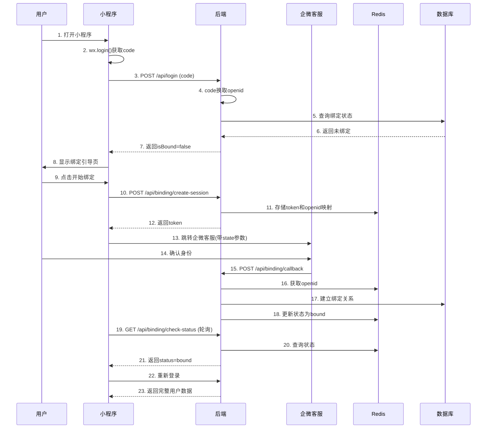

# 企微客服与小程序用户绑定 - 后端对接需求文档

## 📋 需求背景

### 问题描述
- **现状**：小程序使用 `openid` 作为用户标识，后端数据使用 `external_userid`（企微客服标识）
- **问题**：两个标识体系无法匹配，导致前端无法获取对应的用户数据
- **解决方案**：首次登录时引导用户通过企微客服完成身份绑定，建立 openid 和 external_userid 的映射关系

## 🔌 需要后端实现的接口

### 1. 改造登录接口

**接口地址**：`POST /api/login`

**接口说明**：需要在原有登录接口基础上，增加绑定状态的判断和返回

**请求参数**：
```json
{
  "code": "wx.login()获取的临时code"
}
```

**返回数据结构**：
```json
{
  "success": true,
  "token": "JWT token",
  "openid": "用户的openid",
  "isBound": false,              // 【新增】是否已绑定企微
  "external_userid": null,       // 【新增】企微客服用户ID（已绑定时返回）
  "user_id": "数据库用户ID",
  "stats": {
    "total_profiles": 100,
    "today_profiles": 5
  }
}
```

**后端处理逻辑**：
1. 通过 code 调用微信API获取 openid
2. 查询数据库检查该 openid 是否已绑定 external_userid
3. 返回绑定状态和相关信息

### 2. 创建绑定会话

**接口地址**：`POST /api/binding/create-session`

**接口说明**：创建一个临时的绑定会话，生成唯一token供企微客服使用

**请求参数**：
```json
{
  "openid": "用户的openid"
}
```

**返回数据**：
```json
{
  "success": true,
  "token": "550e8400-e29b-41d4-a716-446655440000"  // UUID格式的唯一token
}
```

**后端处理逻辑**：
1. 生成唯一的 UUID 作为绑定token
2. 将 token 和 openid 的映射关系存入 Redis
3. 设置 10 分钟过期时间
4. 记录状态为 `pending`

**Redis存储结构**：
```json
Key: "bind_session:550e8400-e29b-41d4-a716-446655440000"
Value: {
  "openid": "oXXXXXXXXXXXXXXX",
  "status": "pending",
  "created_at": "2024-01-15T10:30:00Z"
}
Expire: 600 seconds
```

### 3. 检查绑定状态

**接口地址**：`GET /api/binding/check-status`

**接口说明**：前端轮询此接口，检查绑定是否完成

**请求参数**：
```
?token=550e8400-e29b-41d4-a716-446655440000
```

**返回数据**：

绑定中：
```json
{
  "status": "pending"
}
```

绑定成功：
```json
{
  "status": "bound",
  "externalUserId": "wm0gZOdQAAZMXhfFKa9kZRMNdRwEVZYQ"
}
```

已过期：
```json
{
  "status": "expired"
}
```

**状态说明**：
- `pending`: 等待用户在企微客服确认
- `bound`: 绑定成功
- `expired`: 会话已过期
- `failed`: 绑定失败

### 4. 企微回调接口（核心）

**接口地址**：`POST /api/binding/callback`

**接口说明**：企微客服会调用此接口，完成绑定关系的建立

**请求参数**：
```json
{
  "state": "550e8400-e29b-41d4-a716-446655440000",  // 绑定会话token
  "external_userid": "wm0gZOdQAAZMXhfFKa9kZRMNdRwEVZYQ"  // 企微客服用户ID
}
```

**返回数据**：
```json
{
  "success": true
}
```

**后端处理逻辑**：
1. 根据 state（token）从 Redis 获取对应的 openid
2. 在数据库中创建或更新 openid 和 external_userid 的绑定关系
3. 更新 Redis 中的会话状态为 `bound`
4. 记录绑定时间

### 5. 解除绑定（可选）

**接口地址**：`POST /api/binding/unbind`

**请求参数**：
```json
{
  "openid": "用户的openid"
}
```

**返回数据**：
```json
{
  "success": true,
  "message": "解绑成功"
}
```

### 6. 获取绑定信息（可选）

**接口地址**：`GET /api/binding/info`

**请求参数**：
```
?openid=oXXXXXXXXXXXXXXX
```

**返回数据**：
```json
{
  "isBound": true,
  "external_userid": "wm0gZOdQAAZMXhfFKa9kZRMNdRwEVZYQ",
  "bind_time": "2024-01-15T10:35:00Z"
}
```

## 💾 数据库设计

### 方案1：修改现有用户表

```sql
-- 在现有的 users 表中添加字段
ALTER TABLE users 
ADD COLUMN external_userid VARCHAR(64) UNIQUE COMMENT '企微客服用户ID',
ADD COLUMN bind_status TINYINT DEFAULT 0 COMMENT '绑定状态: 0-未绑定, 1-已绑定',
ADD COLUMN bind_time DATETIME COMMENT '绑定时间',
ADD INDEX idx_external_userid (external_userid);
```

### 方案2：独立的绑定关系表（推荐）

```sql
-- 创建独立的绑定关系表
CREATE TABLE user_binding (
    id INT PRIMARY KEY AUTO_INCREMENT,
    openid VARCHAR(64) UNIQUE NOT NULL COMMENT '微信openid',
    external_userid VARCHAR(64) UNIQUE COMMENT '企微客服用户ID',
    unionid VARCHAR(64) COMMENT '微信unionid(如果有)',
    bind_status TINYINT DEFAULT 0 COMMENT '绑定状态: 0-未绑定, 1-已绑定',
    bind_time DATETIME DEFAULT CURRENT_TIMESTAMP COMMENT '绑定时间',
    last_login DATETIME COMMENT '最后登录时间',
    created_at DATETIME DEFAULT CURRENT_TIMESTAMP,
    updated_at DATETIME DEFAULT CURRENT_TIMESTAMP ON UPDATE CURRENT_TIMESTAMP,
    INDEX idx_openid (openid),
    INDEX idx_external_userid (external_userid)
) ENGINE=InnoDB DEFAULT CHARSET=utf8mb4 COMMENT='用户绑定关系表';
```

## 🔧 企微配置需求

### 1. 企微客服链接格式

前端会使用以下格式的链接跳转到企微客服：

```
https://work.weixin.qq.com/kf/kfservice?corp_id=ww7b4256dcdcea9b3e&kf_id=kfc6fac668195f8389e&state={token}
```

参数说明：
- `corp_id`: 企业ID（已配置：ww7b4256dcdcea9b3e）
- `kf_id`: 客服账号ID（已配置：kfc6fac668195f8389e）
- `state`: 绑定会话token（动态生成）

### 2. 企微回调配置

需要在企微管理后台配置：
- **回调URL**：`https://your-domain.com/api/binding/callback`
- **回调方式**：POST
- **触发时机**：用户进入客服会话时

### 3. 企微回调数据格式

企微可能使用XML格式回调，需要解析提取：
- `state` 参数（从URL参数中获取）
- `external_userid`（从消息体中获取）

## 🔄 完整业务流程



## ✅ 前端已完成部分

前端已经完成了所有页面和逻辑实现：

- ✅ **绑定引导页面** (`/pages/bind-account/`)
  - 绑定流程UI
  - 自动轮询检查状态
  - 错误处理和重试机制
  
- ✅ **WebView页面** (`/pages/webview/`)
  - 加载企微客服页面
  - 消息通信支持
  
- ✅ **认证管理器改造** (`/utils/auth-manager.js`)
  - 检测绑定状态
  - 自动跳转绑定页面
  
- ✅ **API客户端** (`/utils/api-client.js`)
  - 所有绑定相关API已封装
  
- ✅ **配置管理** (`/utils/constants.js`)
  - 企微配置已添加

## 🧪 测试要点

### 功能测试

1. **未绑定用户流程**
   - 首次登录自动跳转绑定页面
   - 绑定成功后自动登录
   
2. **已绑定用户流程**
   - 直接登录获取数据
   - 无需重复绑定
   
3. **异常情况处理**
   - 绑定超时（10分钟）
   - 网络异常
   - 重复绑定
   - Token过期

### 性能测试

- 轮询频率：2秒/次
- 最大轮询次数：30次（60秒）
- Redis过期时间：10分钟
- 并发绑定处理

### 安全测试

- Token唯一性
- Token过期机制
- 防止恶意绑定
- 数据一致性

## 📝 示例代码

完整的Python后端实现示例：`backend_binding_example.py`

包含：
- FastAPI框架
- MySQL + Redis
- JWT认证
- 完整的绑定流程
- 错误处理
- 并发控制

## 🚀 联调步骤

### 第一阶段：基础接口
1. 实现改造后的登录接口
2. 使用Postman测试
3. 前端验证登录流程

### 第二阶段：绑定流程
1. 实现绑定相关接口
2. 配置Redis
3. 测试绑定会话创建

### 第三阶段：企微对接
1. 配置企微回调
2. 测试回调接口
3. 完整流程测试

### 第四阶段：异常处理
1. 测试各种异常情况
2. 优化用户体验
3. 性能调优

## ⚠️ 注意事项

1. **安全性**
   - 绑定token必须使用UUID
   - 设置合理的过期时间
   - 防止重放攻击

2. **幂等性**
   - 重复绑定同一用户不报错
   - 使用数据库唯一索引保证数据一致性

3. **并发处理**
   - 使用Redis处理并发请求
   - 避免竞态条件

4. **错误恢复**
   - 所有异常都要有明确的错误码
   - 提供友好的错误提示

## 📞 联系方式

如有问题，请随时沟通：
- 前端已完成所有页面和逻辑
- 后端示例代码可供参考
- 接口定义可根据实际情况调整

---

**备注**：这是一个标准的OAuth-like绑定流程，主要解决两个用户体系的映射问题。核心是通过一个临时token作为桥梁，让企微客服能够将external_userid传递给我们的后端，从而建立映射关系。